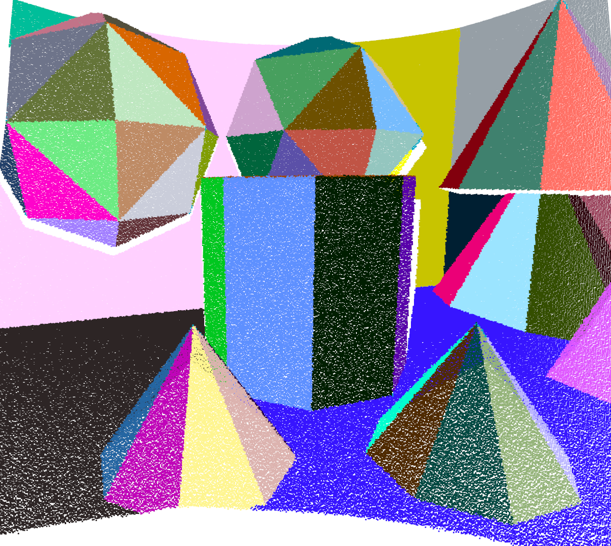
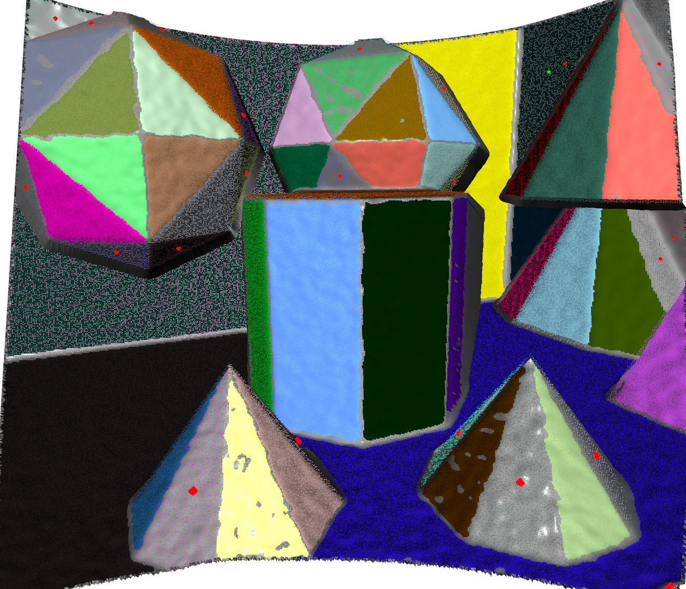
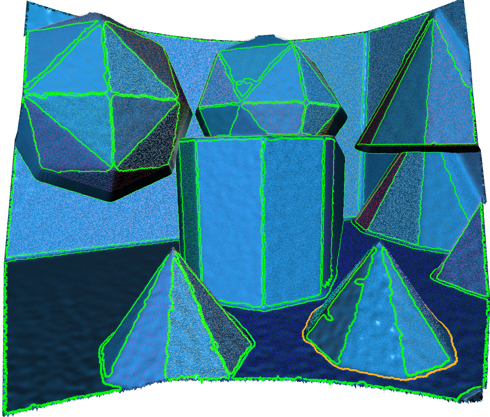
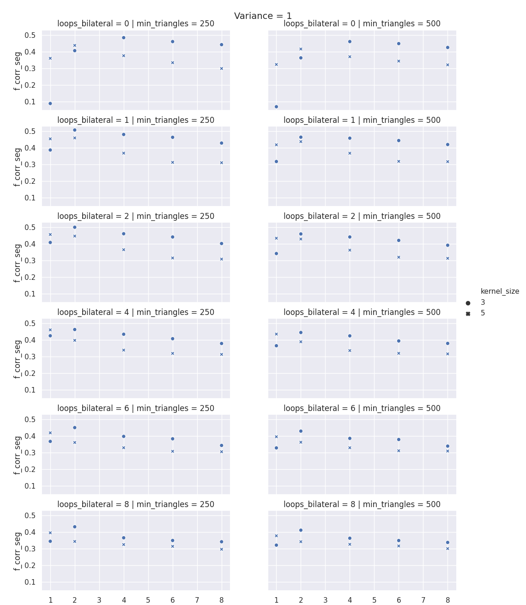

# Polylidar Plane Benchmarks

This repository will benchmark the speed/accuracy of Polylidar3D in extracting planes from organized points clouds (opc). The benchmark set comes from [SynPEB]((http://synpeb.cs.uni-freiburg.de/)).
An example of an opc, planar segmentation, and polygon extraction by Polylidar3D is shown on the first, second, and third image respectively. This pointcloud has the highest level of noise. Note the mesh shown is after using GPU accelerated Laplacian and Bilateral filtering. See paper for details.

<p align="middle">
  
  
   
</p>

## Download Data

Download data from [here](http://synpeb.cs.uni-freiburg.de/). Extract to `data/synpeb` . Heres a directroy of what is expected

``` txt
synpeb
├── LICENSE
├── README.md
├── test
│   ├── gt
│   ├── var1
│   ├── var2
│   ├── var3
│   └── var4
└── train
    ├── gt
    ├── var1
    ├── var2
    ├── var3
    └── var4
```

## Installation

Please begin with first installing a python virtual environment.

1. Install [conda](https://conda.io/projects/conda/en/latest/) - [Why?](https://medium.freecodecamp.org/why-you-need-python-environments-and-how-to-manage-them-with-conda-85f155f4353c)
2. `conda create --name polylidar3d python=3.6 && source activate polylidar3d` - Create new virtual python environment

There are three main dependencies which must be installed. Please `git clone` each of these repositories in separate directories in your workspace. You will need CMake to build each of these repositories. Please note each repo's installation section about building and *installing* `python` bindings. Please be sure that you have activated your newly created virtual environment when building these repositories (`polylidar3d`).

1. [Polylidar3D](https://github.com/JeremyBYU/polylidar)
2. [OPF](https://github.com/JeremyBYU/OrganizedPointFilters)
3. [FastGA](https://github.com/JeremyBYU/FastGaussianAccumulator)

Once that is all done just install any dependencies needed in this repo.

1. `conda install -c conda-forge opencv shapely` - These packages give the most issue for binary dependencies for Windows users, hence why conda should handle them.
2. `pip install -e .` - Install any dependencies for this repository (`polylidar_plane_benchmark`).

## Command Line Interface

A command line interface is provided:

``` 
Usage: ppb [OPTIONS] COMMAND [ARGS]...

  Generates data and run benchmarks for concave algorithms

Options:
  --help  Show this message and exit.  [default: False]

Commands:
  analyze    Analyze Data
  visualize  Visualize Data

```

### Visualize

This subcomand allows you to visualize results of Polylidar3D on the SynPEB dataset. 

``` text
(ppb) ➜  polylidar-plane-benchmark git:(master) ✗ ppb visualize --help    
Usage: ppb visualize [OPTIONS] COMMAND [ARGS]...

  Visualize Data

Options:
  --help  Show this message and exit.  [default: False]

Commands:
  ga            Visualize Gaussian Accumulator From PCD File
  mesh          Visualize Mesh from PCD File
  pcd           Visualize PCD File
  planes        Visualize Plane Extraction from PCD File
  planes-all    Visualize Plane Extraction from training/testing/gt set
  polygons      Visualize Polygon Extraction PCD File
  polygons-all  Visualize Polygon Extraction from training/testing/gt set
```

Just type command --help to get more info. For example `ppb pcd --help` .  

I would just focus on `pcd` , `mesh` , `planes` , and `polygons` commands. In that order.

### Analyze

```
(ppb) ➜  polylidar-plane-benchmark git:(master) ✗ ppb analyze --help  
Usage: ppb analyze [OPTIONS] COMMAND [ARGS]...

  Analyze Data

Options:
  --help  Show this message and exit.  [default: False]

Commands:
  fit-laplacian  Analyze noise in point clouds and determine a *sufficient*...
  pcd-noise      Visualize noise level estimation in point cloud files
  test           Show results of Polylidar on dataset
  training       Show results of hyperparameters for polylidar
```

#### Run Train

This will perform a hyperparameter search of parameters in Polylidar3D that effect accuracy (specifically the % of correctly captured planes, *f*). It only runs on the training set.
This runs training in parallel using Python multiprocessing, each thread works on a set files with the same variance. All data is saved in csv files under `data/synpeb_results` folder. File names will have the form
`synpeb_train_variance_{var}_params_{i}.csv` . 

1. `python polylidar_plane_benchmark/scripts/run_train.py` - 


This will analyze the result of the training by reading the CSV files. Its shows many plots that show how accuracy is affected by changing parameters. Here is an example:



1. `ppb analyze training` 

Based on these results parameters were chosen and used in the test set shown below.

#### Run Test

1. `python polylidar_plane_benchmark/scripts/run_test.py` - This creates 4 csv files(one for each level of variance) with the results in `data/synpeb_results`. Files will be named `synpeb_test_variance_{var}_params_0.csv` .
2. `ppb analyze test` - This will print out mean values of metrics by variance group. A second print out averages everything (reported in paper)

Backups of previous runs are in the folders `backup_stride_1` and `backup_stride_2` .
